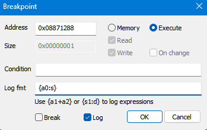

# DISSIDIA 012 package extractor

An all in one tool for file name hashing, files decompiling and recompiling for Dissidia 012 for the PSP. Tested on version ULUS10566. File list included is not finished. At the time of writing this only 3701 of 11043 files, but PRs are welcomed. Should work on other copies of Dissidia as well but you'll need to create a new files list from scratch.

## What is this?

The Dissidia games for PSP have a hashed file lists stored in the PSP_GAME\USRDIR\DATA\PACKAGE_INFO.BIN to their locations in the PSP_GAME\USRDIR\DATA\PACKAGE.BIN file. While other tools just ripped the files out of the PACKAGE.BIN, this tool was create for retaining the file paths for easier file management and modding. Check [how to find file names](#how-to-find-file-names) below. Works great with [DissDlcToolkit](https://github.com/adriangl/DissDlcToolkit).

## How does it work?

The included exe is Windows x64 but can be built for other systems. It is a simple command line tool that you can use by dropping files on it or running [commands](#commands).

**Note:** For best practice, put your PACKAGE.BIN and PACKAGE_INFO.BIN files in the same directory as the exe.

## Commands

Here are all the commands the exe accepts.

**Note:** You can also find all these commands in the --help command.

### package_info

> -p for short.

This command will decompile the path to the PACKAGE_INFO.BIN into a PACKAGE_INFO.json in the same directory. This the file list file without any names. You can also just drop the PACKAGE_INFO.BIN on the app.

**Note:** If the PACKAGE.BIN is in the same folder it will add a 'type' object to the file list by looking at the first 4 bytes of the file. This will hint at the type of unknown file and be used in adding an extension to the unknown file when extracting.

```cmd
dissida_filelist-x64.exe --package_info="C:/psp_games/dissidia/PACKAGE_INFO.BIN"
```

### hash

> -h for short.

Basic hash command to check if the file name is in the file list. Can also accept wild cards.

Wilds for character and series codes are **%2s, %3s, %5s and %6s**.

Code %2s for example becomes "fn" for Firion as well as "tw" for for series FFII.

Code %3s for example becomes 3 letter series code "thr" as FFIII.

Code %5s for example becomes 5 letter character codes "fo100" Cecil.

Code %6s for example becomes the full character codes "gst200" for Gabranth.

Full code lists can be found in [code.js file](src/codes.js).

Wild card for basic increasing numbers are **%1d, %2d, %3d, %4d and %5d** for a 1-5 digital value. **Note:** %1d generates 10 strings replaced with 0-9, while %5d generates 99999 so use with caution!

False positive as possible with wildcards due to the limits of the hashing formula, so do use sparingly!

```cmd
dissida_filelist-x64.exe --hash="voice/en/event/up21/up21_107_190zi.at3"
```

### text

> -t for short.

This is the batch command for --hash. Enter a text file path and it will hash each line.

**Note:** Wild cards are also checked so be careful not to over do it.

```cmd
dissida_filelist-x64.exe --text="C:/psp_games/dissidia/file_names.txt"
```

### sorted

> -s for short.

Creates a sorted PACKAGE_INFO_sorted.json file, based off of the offset in the PACKAGE.BIN file.

```cmd
dissida_filelist-x64.exe --text="C:/psp_games/dissidia/PACKAGE_INFO.json"
```

### extract

> -e for short.

Extracts all files in the PACKAGE_INFO.json file from the PACKAGE.BIN to root directory.

**Note:** Any unknown file names will be in the unknown/ folder.

Can also be run by droping the PACKAGE.BIN file on the exe.

```cmd
dissida_filelist-x64.exe --extract="C:/psp_games/dissidia/PACKAGE.BIN"
```

### replace

> -r for short.

Replace a file in the PACKAGE.BIN file (with in limits). Input path of new file to add / replace in PACKAGE.BIN (name doesn't matter). Must use with --filename for PACKAGE_INFO.json filename entry match. PACKAGE.BIN and PACKAGE_INFO.json must be in root directory.

**Note:** Files are stored in blocks of 2048 bytes. So if a replaced file is bigger than the orginal, the replacement can be rejected if there isn't enough space.

```cmd
dissida_filelist-x64.exe --replace="C:/psp_games/dissidia/new_audio.at3" --filename="voice/en/event/up21/up21_107_190zi.at3"
```

### filename

> -f for short.

Only use with --replace command above.

### compile

> -c for short.

Compiles the PACKAGE_INFO.json back into a PACKAGE_INFO.BIN file. Created normally when using --replace.

Good for advanced editing.

Can also be run by droping the PACKAGE_INFO.json file on the exe.

```cmd
dissida_filelist-x64.exe --compile="C:/psp_games/dissidia/PACKAGE_INFO.json"
```

## How to find file names

I used [PPSPP](https://www.ppsspp.org/) as it has a great dev tools. While the game is running, go to the Debug memu then Disassembly (or ctrl+D). Add a new breakpoint.


Set a log to 0x08871288 address with the fmt of {a0:s}.



Open the log in the Debug memu then log console (or ctrl+L). As you play the game, the files the game is loading from the PACKAGE.BIN will appear.


You can then copy these file names into a text file and drop it on the exe for matching!
